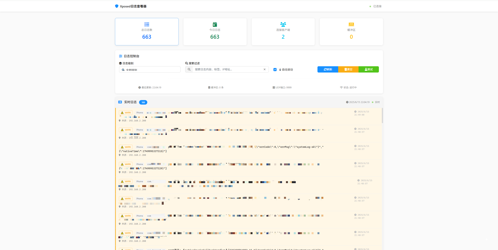

# 🔍 Xposed日志查看器

[](https://www.python.org/)
[](https://flask.palletsprojects.com/)
[](LICENSE)

一个现代化的Xposed模块日志实时查看器，采用大厂设计风格，支持UDP日志接收、WebSocket实时推送、多级过滤和搜索功能。专为Android逆向工程师和安全研究人员设计。

## ✨ 功能特性

### 🚀 核心功能
- **📡 实时日志监控** - UDP服务器接收Xposed模块日志，支持多客户端同时连接
- **⚡ WebSocket推送** - 浏览器实时显示新日志，无需刷新页面
- **🎯 智能分级** - 自动识别INFO/WARN/ERROR/DEBUG级别，支持自定义标签
- **🔍 多维过滤** - 按级别、关键词、时间范围、来源IP过滤
- **🔒 敏感数据检测** - 自动识别手机号、Token、OpenID等敏感信息并高亮
- **💾 数据持久化** - SQLite数据库存储，支持历史查询和数据导出

### 🎨 界面设计
- **🏢 大厂设计风格** - 参考蚂蚁金服/阿里云设计语言，简洁专业
- **📱 响应式布局** - 完美适配桌面和移动端设备
- **📊 实时统计** - 日志数量、连接状态、缓冲区监控一目了然
- **🌙 护眼体验** - 优化的代码查看界面，长时间使用不疲劳

### 🔧 技术特性
- **⚡ 高性能** - 异步处理架构，轻松处理大量日志数据
- **🔗 多客户端** - 支持多个Xposed模块同时连接，互不干扰
- **🛡️ 容错处理** - 网络异常自动重连，数据不丢失
- **🧠 内存优化** - 智能缓冲区管理，避免内存溢出

## 📸 界面预览

> 现代化的大厂设计风格，简洁而专业

### 🖥️ 主控制台

*统计卡片、过滤控制、实时状态一览无余*

## 🚀 快速开始

### 📋 环境要求
- **Python 3.7+** (推荐3.8+)
- **操作系统**: Windows/Linux/macOS
- **内存**: 建议512MB以上可用内存
- **网络**: UDP端口9999和HTTP端口5000
- **浏览器**: Chrome/Firefox/Safari/Edge

### ⚡ 一键启动

1. **下载项目**
```bash
git clone https://github.com/cncsnet1/xposed_log_viewer.git
cd xposed_log_viewer
```

2. **安装依赖**
```bash
pip install -r requirements.txt
```

3. **启动服务** (分别启动服务)
```bash
python app.py
python udp_server.py
```

4. **访问控制台**
```
🌐 Web控制台: http://localhost:5000
📡 UDP日志端口: 9999
```

### 🎯 Windows用户快速启动
```powershell
# 进入项目目录
cd xposed_log_viewer

# 启动服务
python start.py
```

启动成功后会看到：
```
🚀 启动Xposed日志查看器...
📡 UDP服务器启动: 端口 9999
🌐 Web服务器启动: http://localhost:5000
✅ 所有服务已启动，按Ctrl+C停止
```

## 📱 Xposed模块集成

### 🔧 快速集成

只需要在你的Xposed模块中添加以下代码，即可将日志发送到查看器：

#### Java版本 (推荐)
```java
import java.net.DatagramSocket;
import java.net.DatagramPacket;
import java.net.InetAddress;

public class LogSender {
    private static final String LOG_SERVER_IP = "192.168.1.100";  // 修改为你的电脑IP
    private static final int LOG_SERVER_PORT = 9999;
    
    /**
     * 发送日志到查看器
     * @param tag 日志标签 (如: "微信Hook", "支付宝Hook")
     * @param message 日志内容
     */
    public static void sendLog(String tag, String message) {
        try {
            String logContent = tag + ": " + message;
            DatagramSocket socket = new DatagramSocket();
            
            byte[] data = logContent.getBytes("UTF-8");
            DatagramPacket packet = new DatagramPacket(
                data, data.length, 
                InetAddress.getByName(LOG_SERVER_IP), 
                LOG_SERVER_PORT
            );
            
            socket.send(packet);
            socket.close();
            
        } catch (Exception e) {
            XposedBridge.log("发送日志失败: " + e.getMessage());
        }
    }
    
    // 使用示例
    public void hookExample() {
        findAndHookMethod("com.tencent.mm.ui.LauncherUI", "onCreate", new XC_MethodHook() {
            @Override
            protected void afterHookedMethod(MethodHookParam param) throws Throwable {
                sendLog("微信Hook", "LauncherUI创建成功");
            }
        });
    }
}
```

#### Kotlin版本
```kotlin
object LogSender {
    private const val LOG_SERVER_IP = "192.168.1.100"  // 修改为你的电脑IP
    private const val LOG_SERVER_PORT = 9999
    
    fun sendLog(tag: String, message: String) {
        try {
            val socket = DatagramSocket()
            val data = "$tag: $message".toByteArray(Charsets.UTF_8)
            val packet = DatagramPacket(
                data, data.size,
                InetAddress.getByName(LOG_SERVER_IP),
                LOG_SERVER_PORT
            )
            socket.send(packet)
            socket.close()
        } catch (e: Exception) {
            XposedBridge.log("发送日志失败: ${e.message}")
        }
    }
}
```

### 💡 使用技巧

1. **获取电脑IP地址**
   - Windows: 运行 `ipconfig` 查看IPv4地址
   - 确保手机和电脑在同一WiFi网络下

2. **日志分级建议**
   ```java
   sendLog("微信Hook", "info: 用户登录成功");      // 普通信息
   sendLog("微信Hook", "warning: 检测到风控");     // 警告信息  
   sendLog("微信Hook", "error: Hook失败");        // 错误信息
   sendLog("微信Hook", "debug: 参数值=" + param);  // 调试信息
   ```

3. **敏感数据处理**
   ```java
   // 系统会自动检测并高亮显示敏感数据
   sendLog("支付", "获取到手机号: 138****8888");
   sendLog("登录", "Token: eyJhbGciOiJIUzI1NiIs...");
   ```

## ⚙️ 配置说明

### 🔧 服务器配置
如需修改端口或其他设置，编辑 `config.py` 文件：

```python
# 服务器配置
WEB_HOST = '0.0.0.0'      # Web服务器地址 (0.0.0.0表示允许外部访问)
WEB_PORT = 5000           # Web服务器端口
UDP_HOST = '0.0.0.0'      # UDP服务器地址  
UDP_PORT = 9999           # UDP服务器端口 (Xposed模块发送日志的端口)

# 数据库配置
DATABASE_PATH = 'logs.db'  # SQLite数据库文件路径
MAX_LOGS = 10000          # 最大日志存储数量 (超出会自动清理旧日志)

# 缓冲区配置
BUFFER_SIZE = 1000        # 内存缓冲区大小
```

### 📝 支持的日志格式

系统智能识别多种日志格式，**推荐使用纯文本格式**：

#### 1. 纯文本格式 (推荐)
```
微信Hook: 用户登录成功
支付宝Hook: error: 获取支付密码失败
抖音Hook: warning: 检测到反调试
```

#### 2. 带级别的文本格式
```
INFO: 微信启动完成
ERROR: Hook注入失败
WARNING: 发现敏感API调用
DEBUG: 参数值 userId=12345
```

#### 3. JSON格式 (高级用法)
```json
{
    "level": "INFO",
    "tag": "微信Hook", 
    "message": "用户登录成功",
    "timestamp": "2024-01-01T12:00:00"
}
```

> 💡 **智能识别**: 系统会自动从日志内容中识别级别关键词 (info/error/warning/debug) 并进行分类标记


## 🛠️ 项目结构

```
xposed_log_viewer/
├── 📄 app.py              # Flask主应用 (Web服务器)
├── 📡 udp_server.py       # UDP服务器 (接收日志)
├── 🚀 start.py            # 一键启动脚本
├── ⚙️ config.py           # 配置文件
├── 📋 requirements.txt    # Python依赖包
├── 🎨 templates/
│   └── index.html         # 主界面模板
├── 💾 logs.db            # SQLite数据库 (自动创建)
├── 📜 README.md          # 项目说明文档
└── 📄 LICENSE            # MIT开源协议
```

## 🔍 常见问题

### ❓ 启动相关
**Q: 提示端口被占用怎么办？**
A: 修改 `config.py` 中的端口号，或者关闭占用端口的程序

**Q: 手机连不上服务器？**
A: 确保手机和电脑在同一WiFi下，检查防火墙设置

### ❓ 日志相关
**Q: 为什么收不到日志？**
A: 检查Xposed模块中的IP地址是否正确，确保UDP端口9999未被阻止

**Q: 日志显示乱码？**
A: 确保Xposed模块发送UTF-8编码的文本

### ❓ 性能相关
**Q: 日志太多导致卡顿？**
A: 系统会自动清理超出限制的旧日志，也可以手动点击"清空日志"按钮

## 📄 开源协议

本项目采用 [MIT License](LICENSE) 开源协议，可自由使用、修改和分发。

## 🙏 技术栈

- **后端**: Python Flask + SQLite + WebSocket
- **前端**: HTML5 + CSS3 + JavaScript + 大厂设计风格
- **通信**: UDP + WebSocket 实时双向通信
- **数据库**: SQLite 轻量级数据存储

---

**🎯 专为Android逆向工程师打造的专业日志查看工具**

如果这个项目对你的逆向分析工作有帮助，欢迎⭐️Star支持！ 